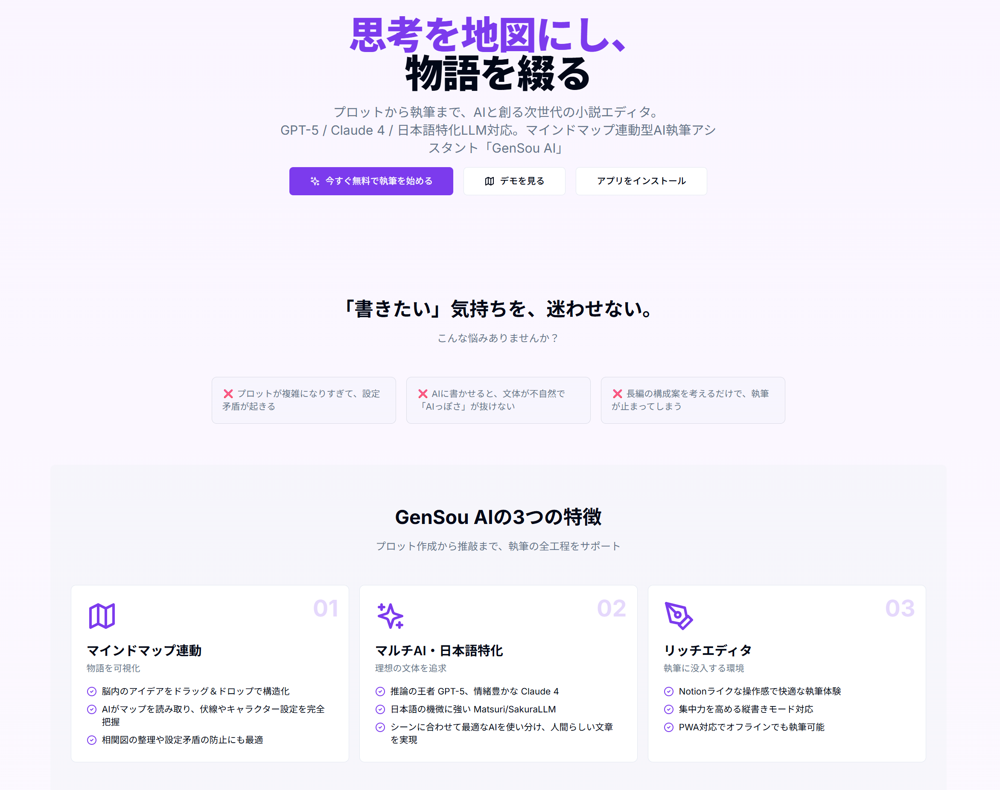

# 🖋️ GenSou AI

An AI-powered novel writing assistant with mind map integration

**Map your thoughts, weave your stories.**




---

## 📖 Documentation

### User Documentation
- [🇯🇵 User Manual (日本語)](./docs/user_manual.md) - ユーザー向け操作手順書

### Engineer Documentation
- [🇯🇵 Engineer Manual (日本語)](./docs/engineer_manual.md) - エンジニア向けシステムインストール・設定手順書
- [🇯🇵 Development & Improvement Plan (日本語)](./plans/project-improvements.md) - 実装予定・機能リスト・改善提案

**[🇯🇵 日本語版 README はこちら](./README_ja.md)**

---

## ✨ Features

### 🧠 Mind Map Integration
- **Visual Plot Creation**: Visualize complex story structures with interactive mind maps
- **Drag & Drop**: Intuitively organize and structure your ideas
- **Auto Generation**: AI automatically generates chapters and outlines from your mind map
- **Consistency Management**: Prevent plot holes with integrated character and setting tracking

### 🤖 Multi-AI Support
| Model              | Use Case                  | Features                  | Cost        |
|--------------------|---------------------------|---------------------------|-------------|
| GPT-5              | Main Model                | Powerful reasoning        | ¥0.004/1K   |
| GPT-4.1            | Stable Option             | Cost-effective            | ¥0.003/1K   |
| Claude 4           | Text Polish               | Natural expression        | ¥0.005/1K   |
| Claude 3.5         | Stable Polish             | Balanced output           | ¥0.0045/1K  |
| SakuraLLM          | Japanese Specialized      | Japanese nuance           | ¥0.001/1K   |
| Matsuri            | Japanese Novel Optimized  | Novel-trained model       | ¥0.0012/1K  |
| DeepSeek-V2        | Mass Generation           | Best cost-performance     | ¥0.0002/1K  |
| Qwen-JP            | Development & Testing     | High-quality Japanese     | ¥0.0004/1K  |

### 📚 Knowledge Base
- **Character Management**: Centralized appearance, personality, and background
- **World Building**: Organize terms, locations, magic systems, and more
- **Tagging System**: Link related items for easy reference
- **AI Integration**: References knowledge base to prevent inconsistencies

### 📖 Rich Editor
- **Notion-like Experience**: Comfortable and intuitive writing
- **Vertical Text Mode**: Perfect for Japanese web novels and doujinshi
- **Chapter Management**: Create, edit, delete, and reorder chapters
- **Auto-save**: Real-time saving of your work

### 📱 PWA Support
- **Offline Ready**: Write anywhere, anytime
- **Installable**: Add to home screen for app-like experience
- **Mobile Optimized**: Responsive design for smartphones and tablets

### 🎨 Japanese Language Specialized
- **Understands Nuances**: Reproduces Japanese-specific expressions and atmosphere
- **Style Learning**: AI learns your writing style
- **Vertical Text Editor**: Full-featured vertical text display

---

## 🚀 Quick Start

### Requirements
- Docker & Docker Compose
- Node.js 18+
- Python 3.10+

### Installation
```bash
git clone https://github.com/parkwoo/gensou-ai.git
cd gensou-ai
cp .env.example .env
# Edit .env to set API keys
# Start with Docker
docker-compose up -d
# Or develop with pnpm
pnpm install
pnpm dev
```
Access: http://localhost:3000

### Seed Test Data
Create Japanese test data with:

```bash
# Run in Docker container
docker-compose exec -T api python scripts/seed_all.py

# Or run locally (from project root)
python scripts/seed_all.py
```

Test data includes:
- Novels: 3 (Time Garden, Beyond the Sea of Stars, Secret of the Clock Tower)
- Knowledge Base: 29 items (characters, settings, locations, terms)

---

## 🛠 Tech Stack

### Frontend
- **Next.js 14** (App Router)
- **TypeScript**
- **Tailwind CSS** + **Shadcn/ui**
- **Zustand** (State Management)
- **TipTap** (Rich Editor)
- **React Flow** (Mind Map)

### Backend
- **FastAPI** (Python)
- **SQLAlchemy** (ORM)
- **SQLite/PostgreSQL** (Database)

### AI
- **Vercel AI SDK**
- **Multi-provider Support** (OpenAI, Anthropic, Qwen/DashScope, DeepSeek, etc.)

### PWA
- **next-pwa**

---

## ✍️ Writing Workflow

1. **Create New Novel**: Enter title and description
2. **Plan with Mind Map**: Visualize story flow
3. **Setup Knowledge Base**: Register characters and terms
4. **Create Chapters**: Plan chapter structure
5. **Write Content**: AI-assisted writing
6. **Polish**: AI-powered text refinement
7. **Export**: Output your completed work

### AI Assist Features
| Feature      | Description                    | Recommended Model    |
|--------------|--------------------------------|----------------------|
| Outline      | Generate story structure       | GPT-5                |
| Chapters     | Generate chapter details       | GPT-5                |
| Content      | Generate actual text           | GPT-5 / Matsuri      |
| Polish       | Refine and beautify text       | Claude 4             |
| De-AI        | Remove AI-like patterns        | Claude 4             |
| Expand       | Expand text                    | GPT-5                |
| Evaluate     | AI evaluation                  | GPT-5                |

---

## 💰 Cost Estimation

| Service           | Cost           |
|-------------------|----------------|
| Vercel (Frontend) | Free (Hobby)   |
| Railway (Backend) | Free           |
| Supabase (DB)     | Free           |
| AI API            | ¥5,000/month〜 |

※ AI API costs vary based on usage

---

## 🔑 SEO Keywords

Novel writing app, plot creation, AI novel generation, mind map, vertical text editor, web novel, writing tool, proofreading, style learning, Japanese LLM, story structure, outline creation, plot template, AI assistant, PWA, offline support

---

## 🗺️ Roadmap

### ✅ Implemented
- [x] Mind map integrated editor
- [x] Multi-AI model support
- [x] Knowledge base management
- [x] Chapter management (create/edit/delete/reorder)
- [x] Vertical text editor
- [x] PWA support
- [x] Dark mode
- [x] Markdown export

### 🚧 In Development
- [ ] AI assist panel (content generation/polish)
- [ ] Fine-tuning features
- [ ] Export functionality (PDF/EPUB)

### 📋 Planned
- [ ] Mobile app optimization
- [ ] Collaboration features
- [ ] Version management

---

## 🤝 Contributing

Contributions are welcome! Please follow these steps:

1. Fork the repository
2. Create a feature branch (`git checkout -b feature/your-feature`)
3. Commit your changes (`git commit -m 'Add your feature'`)
4. Push to the branch (`git push origin feature/your-feature`)
5. Open a Pull Request

---

## 📄 License

MIT License - Free for commercial use, modification, and distribution

---

## 🙏 Acknowledgments

- [Next.js](https://nextjs.org/)
- [FastAPI](https://fastapi.tiangolo.com/)
- [TipTap](https://tiptap.dev/)
- [Shadcn/ui](https://ui.shadcn.com/)
- [React Flow](https://reactflow.dev/)
- [Vercel AI SDK](https://sdk.vercel.ai/)

---

## 📞 Contact

- GitHub Issues: [Create Issue](https://github.com/parkwoo/gensou-ai/issues)
- Website: [https://github.com/parkwoo/gensou-ai/](https://github.com/parkwoo/gensou-ai/)

---

**[🇯🇵 日本語版 README はこちら](./README_ja.md)**

---

**GenSou AI - Map your thoughts, weave your stories.**

Happy Writing! 🖋️✨
