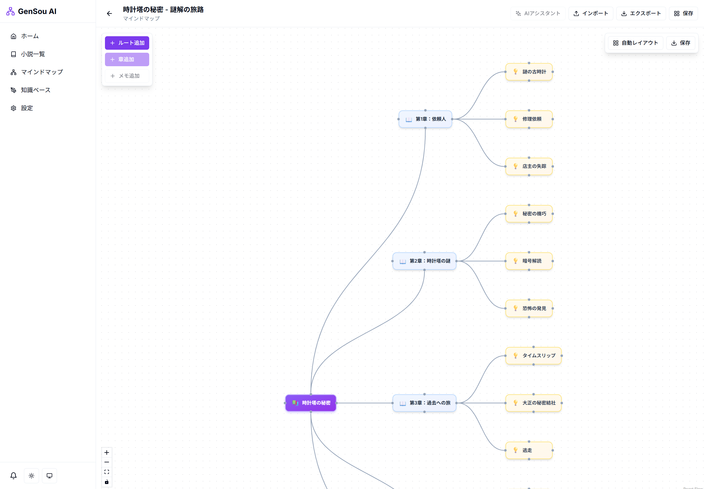
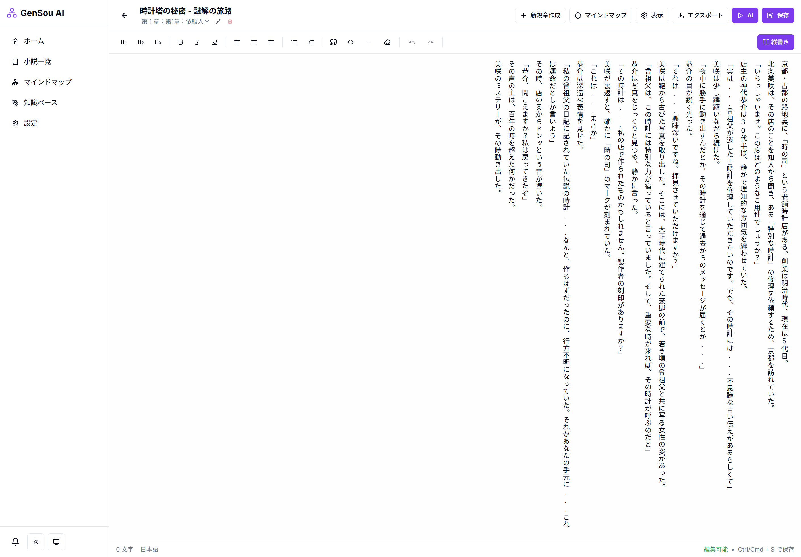

# 🖋️ GenSou AI


---

## About GenSou（玄想）

「GenSou」は日本語の「玄想」（げんそう）に由来します。
「玄」は深い・奥深いを意味し、「想」は思考・創造を意味します。
合わせた「玄想」には、「深く考え、創る」というニュアンスが込められています。
このプロジェクト名は、物語創作において深い思考と自由な想像力を支えるAIツールというミッションを反映しています。

---

## 📖 ドキュメント

### ユーザー向け
- **[ユーザーマニュアル](./docs/user_manual.md)** - 一般ユーザー向け操作手順書
  - サービス利用手順
  - 各画面の説明
  - よくある質問（FAQ）
  - トラブルシューティング

### エンジニア向け
- **[エンジニアマニュアル](./docs/engineer_manual.md)** - システムインストール・設定手順書
  - システム構成概要
  - インストール手順
  - 各種設定・拡張方法
- **[開発計画・改善計画](./plans/project-improvements.md)** - 開発予定・機能リスト・改善提案

---

## 概要

**GenSou AI** は、マインドマップ連動型 AI 小説執筆アシスタントです。プロットが書けないを解決し、物語の構成から執筆・推敲までを AI と共に創る次世代の執筆環境を提供します。

---

## 🚀 クイックスタート

### 必要条件
- Docker & Docker Compose
- Node.js 18+
- Python 3.10+

### インストール
```bash
git clone https://github.com/parkwoo/gensou-ai.git
cd gensou-ai
cp .env.example .env
# .envを編集してAPIキーを設定
# Dockerで起動
docker-compose up -d
# またはpnpmで開発
pnpm install
pnpm dev
```
アクセス：http://localhost:3000

### テストデータの投入
```bash
# Dockerコンテナ内で実行
docker-compose exec -T api python scripts/seed_all.py

# またはローカルで実行（プロジェクトルートから）
python scripts/seed_all.py
```

テストデータ：
- 小説 3作品（時の庭園・星の海の向こう側・時計塔の秘密）
- 知識ベース 29件（登場人物・設定・場所・用語）

---

## ✨ 主な特徴

### 🧠 マインドマップ連動型プロット作成



- 視覚的なプロット作成、ドラッグ＆ドロップでの構造化
- 自動レイアウト機能で整理、設定矛盾の防止

### 🤖 マルチAI対応（8モデル）
| モデル | 用途 | コスト |
|--------|------|--------|
| GPT-5 | 主力モデル | ¥0.004/1K |
| Claude 4 | 文章仕上げ | ¥0.005/1K |
| Matsuri | 日本語小説向け | ¥0.0012/1K |
| Qwen (DashScope) | 開発・テスト生成 | ¥0.0004/1K |
| その他 | SakuraLLM, DeepSeek-V2 等 | - |

### 📚 知識ベース管理
- キャラクター・設定・場所・用語の登録・管理
- タグ付けによる関連項目の紐付け

### 📖 リッチエディタ



- Notion ライクな操作感
- 縦書き/横書きモード切り替え
- 章管理・自動保存

### 📱 PWA サポート
- オフライン対応、ホーム画面追加
- モバイル最適化

---

## 🗺️ ロードマップ

### ✅ 実装済み
- マインドマップ連動型エディタ
- 複数 AI モデル対応
- 知識ベース管理
- 縦書きエディタ
- PWA 対応・ダークモード
- Markdown エクスポート

### 🚧 開発中
- AI アシストパネル（本文生成・推敲）
- ファインチューニング機能
- エクスポート機能（PDF/EPUB）

### 📋 予定
- モバイルアプリ最適化
- コラボレーション機能
- バージョン管理

---

## 💰 コスト試算

| サービス | 費用 |
|---------|------|
| Vercel (Frontend) | ¥0 (Hobby) |
| Railway (Backend) | ¥0 |
| Supabase (DB) | ¥0 |
| AI API | ¥5,000/月〜 |

---

## 🤝 コントリビュート

貢献を歓迎します！詳しくは[エンジニアマニュアル](./docs/engineer_manual.md)をご参照ください。

---

## 📄 ライセンス

MIT License - 商用利用・改変・配布すべて自由

---

## 📞 お問い合わせ

- GitHub Issues: [新規作成](https://github.com/parkwoo/gensou-ai/issues)
- Web サイト: [https://github.com/parkwoo/gensou-ai/](https://github.com/parkwoo/gensou-ai/)

---


**[🇺🇸 English version](./README.md)** | **GenSou AI - 思考を地図にし、物語を綴る。**

Happy Writing! 🖋️✨
