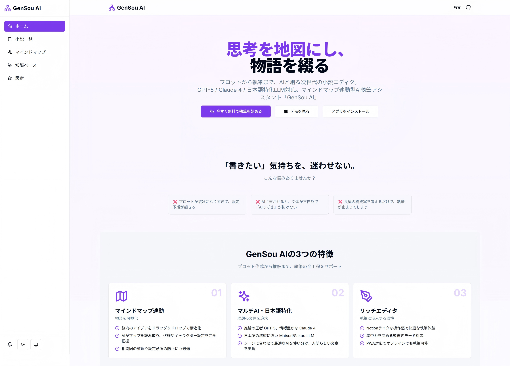
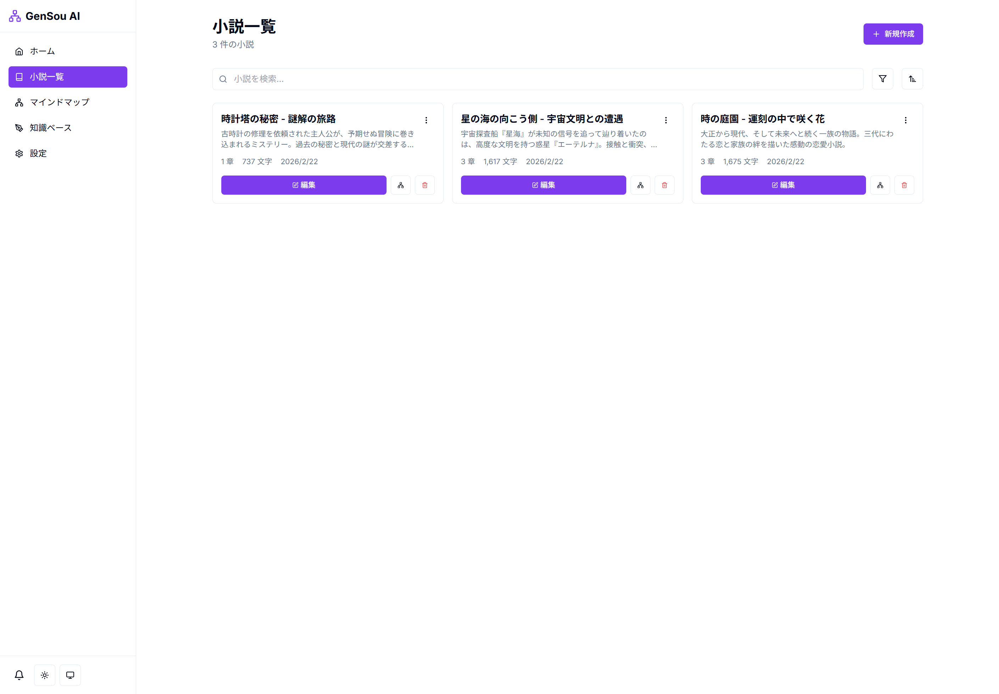
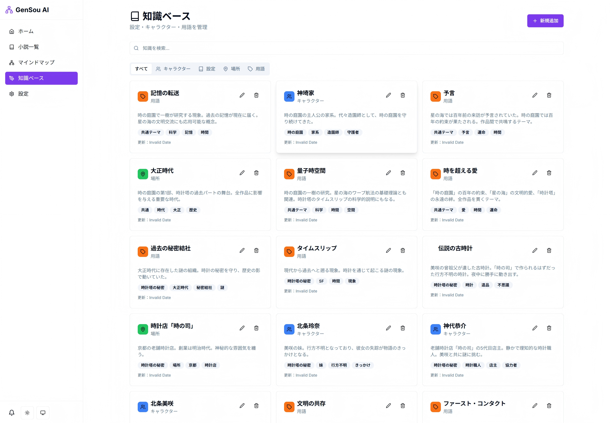

# GenSou（玄想）ユーザー用手順書

## はじめに
『GenSou（玄想）』は、AIとマインドマップを活用した小説執筆支援ツールです。直感的な操作と多彩なAIモデルで、プロット作成から本文生成までをサポートします。

**Map your thoughts, weave your stories.（思考を地図にし、物語を綴る）**

## 1. サービス利用手順

### 1-1. アクセス・初期設定
1. Webブラウザで http://localhost:3000/ にアクセス
2. トップページの「今すぐ無料で執筆を始める」または「デモを見る」ボタンをクリック
3. 新規小説作成ダイアログでタイトルと説明を入力
4. 各種設定（APIキー、テーマなど）は「設定」ページから行えます

### 1-2. 小説執筆の流れ
1. **作品作成**: タイトル・説明文を入力し新規作品を作成
2. **マインドマップ**: プロットや構成を視覚的に整理
   - ルートノード、章ノード、メモノードを追加
   - 自動レイアウト機能で整理
   - ノード同士を接続して物語の流れを可視化
3. **知識ベース**: キャラクター・設定・場所・用語を登録・管理
   - タグ付けで関連アイテムを整理
   - 検索機能で素早くアクセス
4. **本文執筆**: エディタで章ごとの本文を執筆
   - 縦書き/横書きモードの切り替え
   - AIアシストパネルで文章生成や推敲
   - Ctrl/Cmd + S で自動保存
5. **AI活用**: 複数のAIモデルを使い分けて執筆をサポート
   - GPT-5、Claude 4、Matsuri（セルフホスト）、SakuraLLM（セルフホスト）等に対応
   - 温度や最大トークン数を調整可能

### 1-3. 対応AIモデル一覧

| モデル | 用途 | 特徴 | コスト目安 |
|--------|------|------|-----------|
| GPT-5 | メインモデル | 最強の推論能力 | ¥0.004/1K tokens |
| GPT-4.1 | 安定した選択肢 | コストパフォーマンス | ¥0.003/1K tokens |
| Claude 4 | 文章仕上げ | 自然な表現 | ¥0.005/1K tokens |
| Claude 3.5 | 安定した仕上げ | バランスの良い出力 | ¥0.0045/1K tokens |
| SakuraLLM | 日本語特化 | 日本語の機微 | ¥0.001/1K tokens ⚠️ セルフホスト必要 |
| Matsuri | 日本語小説 | 小説特化モデル | ¥0.0012/1K tokens ⚠️ セルフホスト必要 |
| DeepSeek-V2 | 大量生成 | 最高のコスパ | ¥0.0002/1K tokens |
| Qwen (DashScope) | 日本語特化 | 高品質な日本語 | ¥0.0004/1K tokens |

## 2. 各画面の説明

### 2-1. トップページ（/）

**機能:**
- 「今すぐ無料で執筆を始める」: 新規エディタを開く
- 「デモを見る」: マインドマップのテンプレートを体験
- 「アプリをインストール」: PWAとしてホーム画面に追加

**特徴:**
- サービスの概要と主要機能の紹介
- 対応AIモデルとコストの比較表
- よくある質問（FAQ）セクション

### 2-2. 小説一覧画面（/novels）

**機能:**
- 小説の新規作成: タイトルと説明を入力して作成
- 検索・並び替え: 更新日順またはタイトル順でソート
- 小説カードから編集・マインドマップ・削除が可能

**表示項目:**
- 小説タイトルと説明
- 章数、文字数、更新日時
- 編集・マインドマップ・削除ボタン

### 2-3. マインドマップ画面（/mindmap/[novelId]）

**基本操作:**
- **ルート追加**: 新しいテーマノードを作成
- **章追加**: 選択したノードの下に章ノードを追加
- **メモ追加**: 選択したノードの下にメモノードを追加
- **ノード編集**: ノードを選択して名前を変更
- **削除**: 選択したノードを削除（接続エッジも削除）
- **自動レイアウト**: ノードを自動的に整理
- **保存**: マインドマップの状態を保存

**ノードの種類:**
- 📚 ルートノード（テーマ）: 紫色のグラデーション
- 📖 章ノード: 青色のグラデーション
- 💡 メモノード: オレンジ色のグラデーション

**操作方法:**
- ドラッグ＆ドロップでノードを移動
- ノードのハンドル（4方向）からエッジを接続
- グリッドにスナップして配置

### 2-4. 知識ベース画面（/knowledge）

**タブ分類:**
- すべて: 全ての知識アイテム
- キャラクター: 登場人物の管理
- 設定: 世界観や設定の管理
- 場所: 登場場所の管理
- 用語: 重要用語の管理

**機能:**
- **新規追加**: ダイアログからタイプ、名前、説明、タグを入力
- **編集**: 既存アイテムの内容を修正
- **削除**: アイテムの削除
- **検索**: 知識をキーワードで検索

**表示項目:**
- アイテム名とタイプ
- 説明文（3行まで表示）
- タグ一覧
- 更新日時

### 2-5. エディタ画面（/editor/[novelId]）

**基本機能:**
- リッチエディタ: 太字、斜体、下線、配置
- 縦書き/横書きモード切り替え
- 文字数カウント
- Ctrl/Cmd + S で保存

**AIアシストパネル（一部実装済み）:**
- モデル選択: 8種類のAIモデルから選択
- 温度調整: 0.0〜2.0で創造性を制御
- 最大トークン数: 512〜8192
- 指定入力: AIへのプロンプトを入力
- 選択テキストの参照: エディタで選択したテキストをAIに渡す
- 生成結果のコピー・挿入

**ツールバー:**
- 文字装飾ボタン（太字、斜体、下線）
- 縦書きモード切り替え
- 保存ボタン

## 3. よくある質問（FAQ）

### Q1: スマホでも執筆できますか？
**A:** はい、PWA対応でアプリ同様に使えます。ブラウザからアクセスしてホーム画面に追加するだけで、どこでも執筆可能です。

### Q2: AIアシストの使い方は？
**A:** エディタ画面のサイドパネルからAIアシスタントを開きます。モデルを選択し、指示を入力して「生成」ボタンをクリックします。選択したテキストに対して推敲や続きの執筆が可能です。

### Q3: 自分の執筆スタイルを学習させられますか？
**A:** ファインチューニング機能（開発中）でご自身の文体やスタイルをAIに学習させることが可能です。過去作品をアップロードしてAIに学習させることで、より自分らしい文章生成ができます。

### Q4: 外部への出力形式は？
**A:** テキスト、Markdown等の形式で出力可能です。PDF対応も現在開発中です。

### Q5: 料金はいくらかかりますか？
**A:** 基本機能は永続無料（MITライセンスのオープンソース）。AI利用時のみ、使用したモデルの従量課金が発生します。詳細は各AIモデルのコスト表を参照してください。

### Q6: データはどこに保存されますか？
**A:** 現在はローカル環境で動作しており、データはデータベースに保存されます。クラウド連携機能は今後のアップデートで予定されています。

### Q7: 設定矛盾や伏線回収をAIでチェックできますか？
**A:** マインドマップや知識ベースを参照することで、設定矛盾の防止に役立ちます。AIによる自動チェック機能は開発中です。

### Q8: カスタマイズや拡張は可能ですか？
**A:** はい、オープンソース（MITライセンス）なので、テーマやショートカット、エクスポート形式など自由に拡張できます。

## 4. トラブルシューティング

### 4-1. 執筆データが消えた場合
エディタには自動保存機能が実装されています（Ctrl/Cmd + S）。万が一データが消えた場合は、ブラウザのキャッシュやローカルストレージを確認してください。

### 4-2. AI生成が不自然な場合
- プロットやキャラクター設定を詳細に入力してください
- AIモデルを切り替えてみてください（Claude 4は自然な表現に強みがあります）
- 温度パラメータを調整してください（0.7〜1.0が推奨）
- 選択テキスト機能を使って、既存の文体をAIに参照させてください

### 4-3. マインドマップが複雑になりすぎた場合
- 「自動レイアウト」機能を使用してノードを整理してください
- 不要なノードやエッジを削除して構造を簡素化してください
- 複数のルートノードに分けて管理することをお勧めします

### 4-4. APIキーの設定方法
1. 各AIサービスのAPIキーを取得してください
2. 「設定」ページから各サービスのAPIキーを入力してください
3. LocalStorageに安全に保存されます

### 4-5. ショートカットキー一覧
- **Ctrl/Cmd + S**: 保存
- **Ctrl/Cmd + B**: 太字
- **Ctrl/Cmd + I**: 斜体
- **Ctrl/Cmd + U**: 下線

## 5. 開発状況とロードマップ

### 実装済み機能 ✅
- マインドマップ連動エディタ
- マルチAIモデルサポート（8種類）
- 知識ベース管理（キャラクター、設定、場所、用語）
- 章管理（作成・編集・削除・並び替え）
- 縦書きエディタ
- PWA対応
- ダークモード
- 小説一覧・検索・並び替え
- Markdown エクスポート

### 開発中機能 🚧
- AIアシストパネル（生成結果のカーソル位置挿入）
- ファインチューニング機能
- エクスポート機能（PDF/EPUB）

### 今後の予定 📋
- モバイルアプリ最適化
- コラボレーション機能
- バージョン管理
- クラウド同期
- オフライン対応の強化

## 6. ライセンスと貢献

### ライセンス
MIT License - 商用利用、改造、配布が自由です。

### 貢献方法
Contributions are welcome!

1. GitHubリポジトリをフォーク
2. 機能ブランチを作成（`git checkout -b feature/your-feature`）
3. 変更をコミット（`git commit -m 'Add your feature'`）
4. ブランチにプッシュ（`git push origin feature/your-feature`）
5. プルリクエストを作成

### お問い合わせ
- GitHub Issues: [https://github.com/parkwoo/gensou-ai/issues](https://github.com/parkwoo/gensou-ai/issues)
- ウェブサイト: [https://github.com/parkwoo/gensou-ai/](https://github.com/parkwoo/gensou-ai/)

---

**GenSou AI - 思考を地図にし、物語を綴る。**

Happy Writing! 🖋️✨
